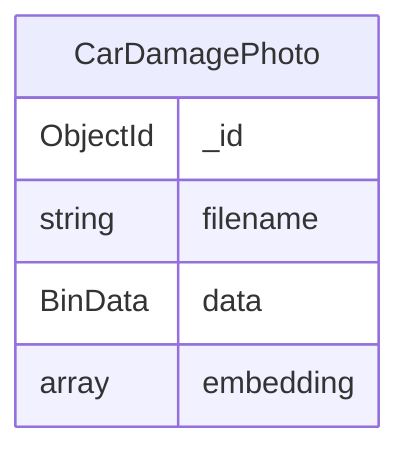

# Entity Document Diagram: Insurance Claims Image Vector Search

This EDD documents the MongoDB data model used by `image_similarity.ipynb`. Use it as the source of truth before changing collection names, document fields, MongoDB Vector Search indexes, or query logic.

## EDD

```
Entity: CarDamagePhoto    [indexes: {embedding:"vector"}(image_vector_index)]

  _id: ObjectId
  filename: string
  data: BinData
  embedding: double[1000,1000,1000]
```



Index details:

```json
{
  "name": "image_vector_index",
  "type": "vectorSearch",
  "database": "claim_resolution",
  "collection": "car_damage_photos",
  "definition": {
    "fields": [
      {
        "type": "vector",
        "path": "embedding",
        "numDimensions": 1000,
        "similarity": "cosine"
      }
    ]
  }
}
```

## Namespace

```text
Database: claim_resolution
Collection: car_damage_photos
```

## Query Pattern

The notebook computes an embedding for a query image and uses `$vectorSearch` to return the five most similar stored images:

```javascript
[
  {
    "$vectorSearch": {
      "index": "image_vector_index",
      "path": "embedding",
      "queryVector": query_embedding,
      "numCandidates": 100,
      "limit": 5
    }
  },
  {
    "$project": {
      "filename": 1,
      "score": { "$meta": "vectorSearchScore" }
    }
  }
]
```

## Design Notes

- This demo uses a single collection; there are no embedded entities, references, extended references, or polymorphic fields.
- `embedding` is modeled as a fixed-length array because TorchVision SqueezeNet outputs 1000 values in this notebook.
- The Vector Search index must stay aligned with the embedding model output dimension.
- GitHub currently does not report a repository license for this project. This PR intentionally does not add or change licensing.
- Do not store real customer claim images or personally identifiable information in this demo dataset.
