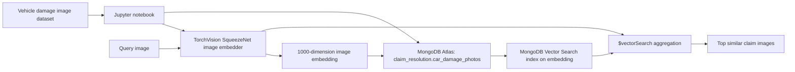

# Insurance Claims Image Vector Search with MongoDB

**Tech stack tags:** `mongodb` `mongodb-atlas` `mongodb-vector-search` `python` `jupyter-notebook` `pymongo` `torchvision` `computer-vision` `image-similarity` `insurance-claims`


[](https://colab.research.google.com/github/mongodb-industry-solutions/Insurance-image-search/blob/main/image_similarity.ipynb)

This repository demonstrates how to build an insurance claims image similarity workflow with MongoDB Vector Search. It embeds vehicle damage photos with a pretrained computer vision model, stores the image vectors and metadata in MongoDB, and retrieves visually similar claims images for faster triage and review.

## Capabilities

- Generate image embeddings from vehicle damage photos with a pretrained TorchVision model.
- Store image binaries, filenames, and embedding vectors in MongoDB Atlas.
- Query similar insurance claim photos with MongoDB Vector Search.
- Visualize the query image and top matches directly in a Jupyter notebook.
- Use a documented MongoDB data model for agent-friendly maintenance.

## Why use MongoDB for image similarity search?

- **Vector storage and similarity search:** MongoDB Vector Search stores image embeddings with the source image documents and retrieves visually similar vehicle damage photos with cosine similarity.
- **Flexible document model:** MongoDB stores image metadata, binary image payloads and model-generated vectors in a single collection without requiring a rigid relational schema.

## Tech Stack

- **Notebook interface:** Jupyter Notebook for interactive data loading, embedding generation, querying, and visualization.
- **Language:** Python for data processing, model inference, and MongoDB access.
- **Machine learning:** TorchVision SqueezeNet for image embedding generation.
- **Database:** MongoDB Atlas for storing image documents and vectors.
- **Search:** MongoDB Vector Search for nearest-neighbor retrieval over image embeddings.
- **Driver:** PyMongo for connecting to MongoDB Atlas.

## Architecture Overview



## Prerequisites

Before running this demo, install or configure:

- [Python 3.10 or above](https://www.python.org/downloads/)
- [MongoDB Atlas cluster](https://www.mongodb.com/docs/atlas/tutorial/deploy-free-tier-cluster/)
- Atlas database user credentials with read/write access
- Network access from your local environment to the Atlas cluster

## Quick Start

### 1. Clone the repository

```bash
git clone https://github.com/mongodb-industry-solutions/Insurance-image-search.git
cd Insurance-image-search
```

### 2. Create a Python environment

```bash
python3 -m venv .venv
source .venv/bin/activate
python -m pip install --upgrade pip
python -m pip install -r requirements.txt
```

### 3. Configure MongoDB Atlas

Create a free or dedicated [MongoDB Atlas cluster](https://www.mongodb.com/docs/atlas/tutorial/deploy-free-tier-cluster/), then set your connection string as an environment variable:

```bash
export MONGODB_URI="mongodb+srv://<username>:<password>@<cluster-name>/?retryWrites=true&w=majority"
```

### 4. Run the notebook

```bash
jupyter notebook image_similarity.ipynb
```

Run the cells in order. The notebook downloads a sample car damage image dataset, writes images to `car_damage/`, inserts image documents into MongoDB Atlas, builds a vector search index and queries for similar images.

## Data Model

The notebook writes documents to:

```text
Database: claim_resolution
Collection: car_damage_photos
```

Each document stores:

- `filename`: source image filename.
- `data`: image binary data.
- `embedding`: 1000-dimension image vector generated by TorchVision SqueezeNet.

See [EDD.md](./EDD.md) for the full entity document diagram, field definitions, index contract, and Mermaid schema diagram.

## Testing

Run the default notebook contract tests:

```bash
python -m pip install -r requirements-dev.txt
pytest -m "not integration"
```

Run the Atlas-backed end-to-end notebook test when you have a test cluster and matching Vector Search index:

```bash
export MONGODB_URI="mongodb+srv://<username>:<password>@<cluster-name>/?retryWrites=true&w=majority"
export NOTEBOOK_MAX_DATASET_IMAGES=5
export NOTEBOOK_CLEAR_COLLECTION=true
python -m pip install -r requirements.txt -r requirements-dev.txt
pytest -m integration
```

`NOTEBOOK_CLEAR_COLLECTION=true` clears `claim_resolution.car_damage_photos` before loading the test data. Use it only with a disposable test database.

## Example

Example query image:


Example top-5 similar image output:


## Additional Resources

- [MongoDB Vector Search documentation](https://www.mongodb.com/docs/atlas/atlas-vector-search/)
- [PyMongo driver documentation](https://www.mongodb.com/docs/languages/python/pymongo-driver/current/)
- [TorchVision model documentation](https://pytorch.org/vision/stable/models.html)
- [MongoDB aggregation documentation](https://www.mongodb.com/docs/manual/aggregation/)

## License

[Apache 2.0](LICENSE)

## Disclaimer

This repository is for educational use and is not a supported MongoDB product.